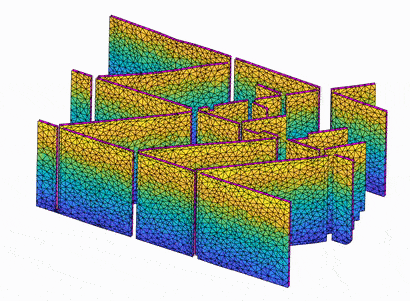
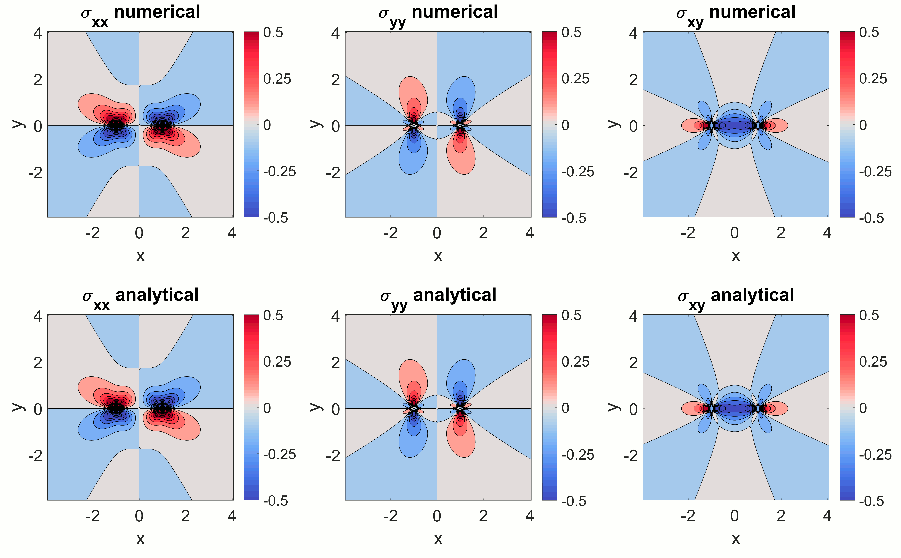
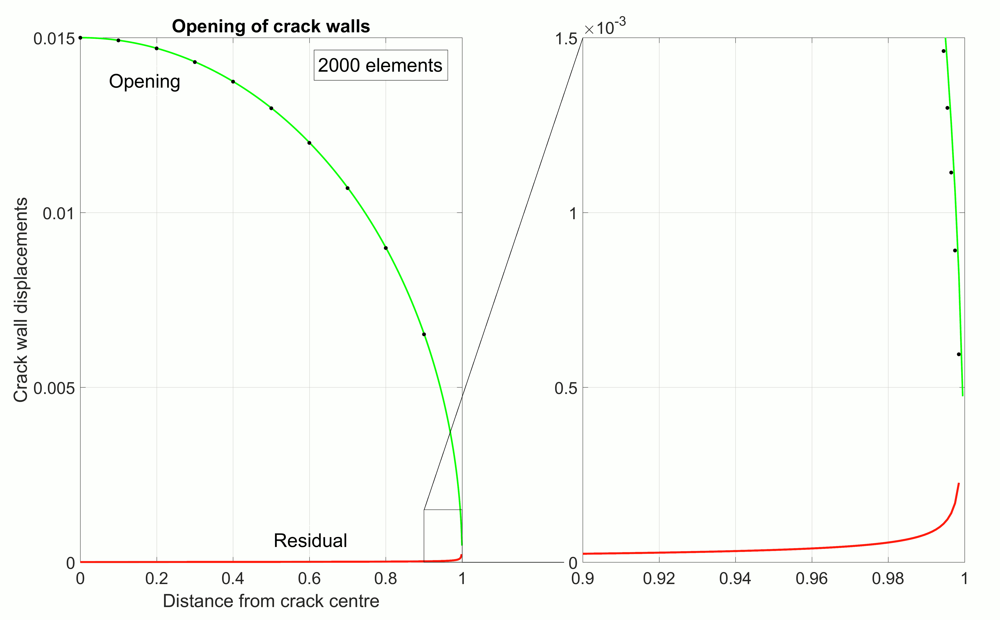
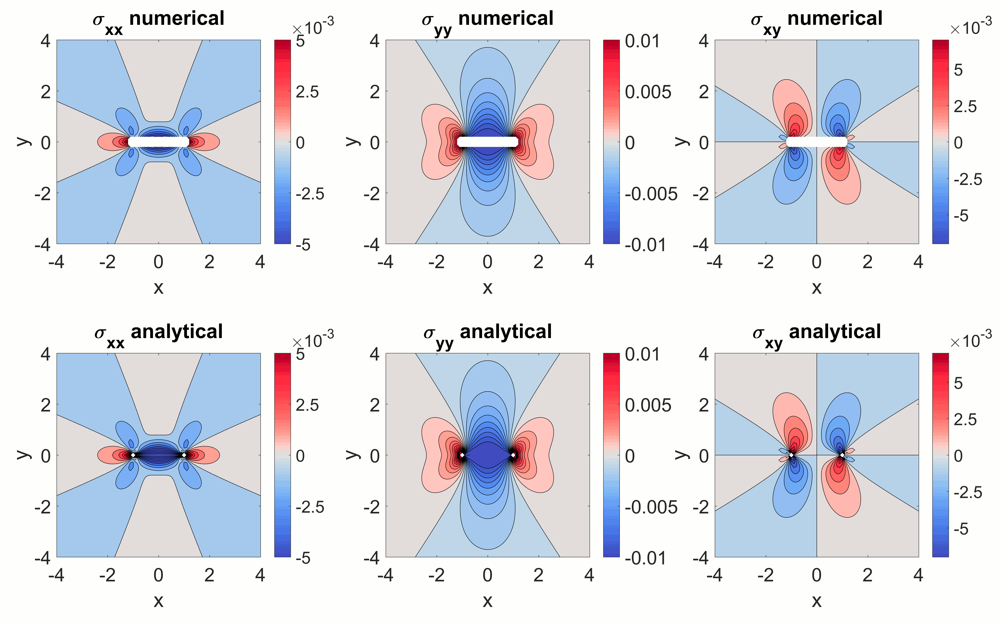
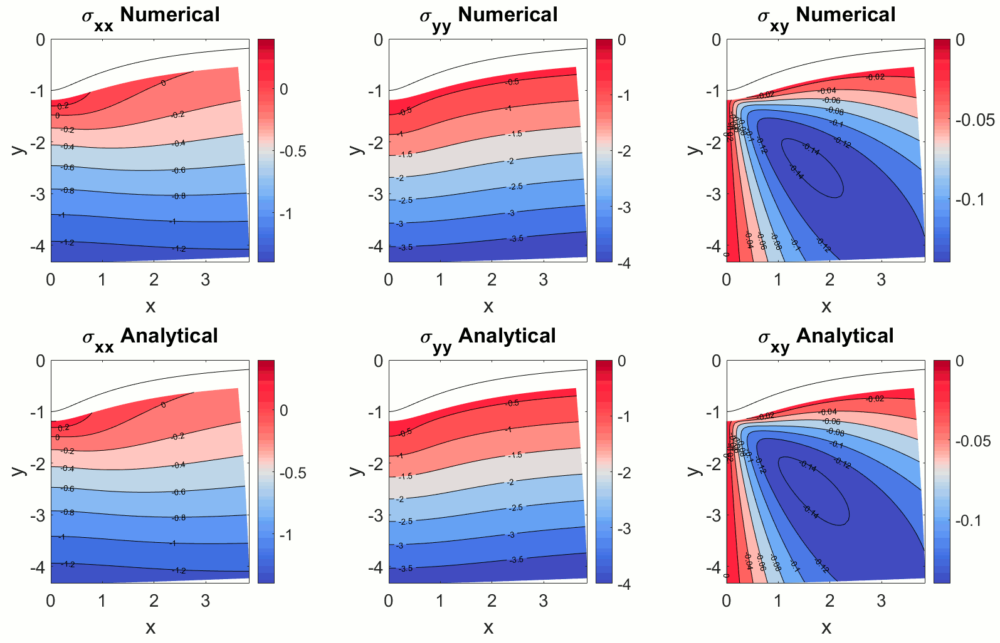
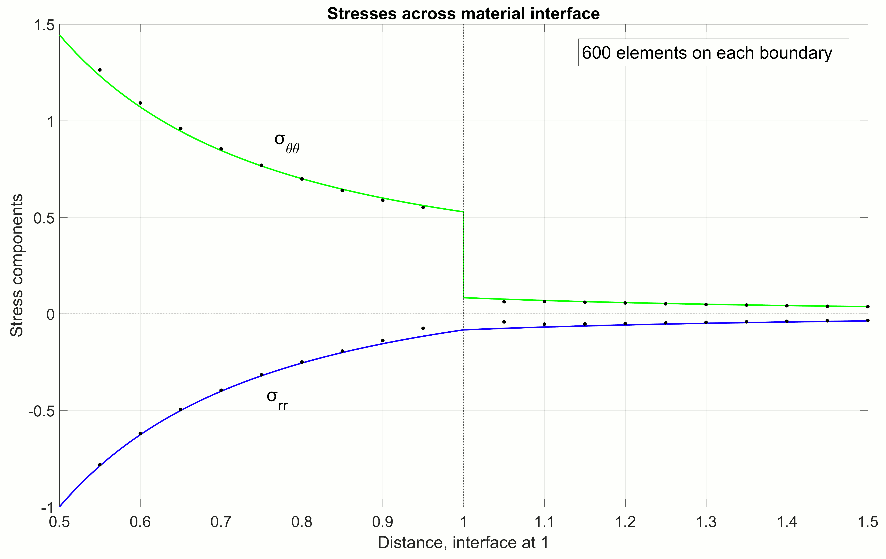
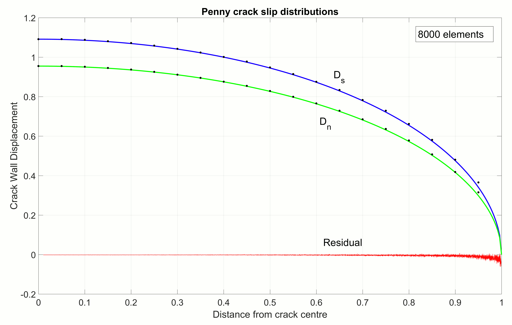
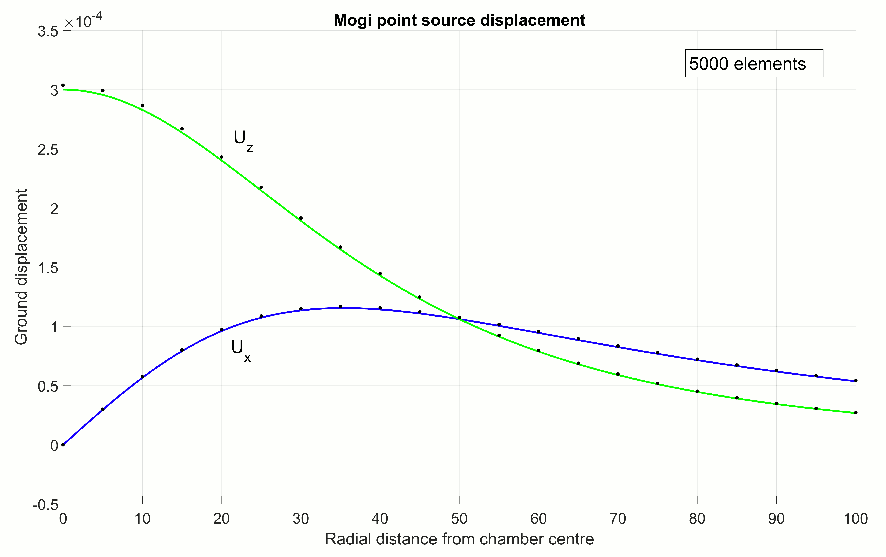
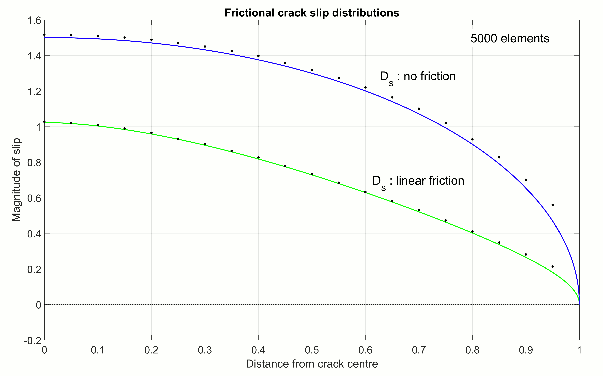

# BEM_DDM_MATLAB

<!-- MarkdownTOC -->

- [Introduction](#introduction)
- [1. How to run](#1-how-to-run)
- [2. Analytical tests](#2-analytical-tests)
    - [2.1. 2D Analytical tests](#21-2d-analytical-tests)
    - [2.2. 3D Analytical tests](#22-3d-analytical-tests)
- [3. Files and data format](#3-files-and-data-format)
    - [3.1. 2D files and data](#31-2d-files-and-data)
    - [3.2. 3D files and data](#32-3d-files-and-data)
    - [3.3. Code structure](#33-code-structure)	
- [4. Elements used in 2D and 3D](#4-elements-used-in-2d-and-3d)    
- [5. Code highlights and applications](#5-code-highlights-and-applications)  
- [6. Acknowledgements](#6-acknowledgements)  

<!-- /MarkdownTOC -->

Gif of a fault array shearing due to a remote stress. Computed using the 3D code
## Citation

Davis, T., 2017. A new open source boundary element code and its application to geological deformation: Exploring stress concentrations around voids and the effects of 3D frictional distributions on fault surfaces (M.Sc thesis. Aberdeen University)

## Introduction

### Boundary Element MATLAB code. Modelling faults and deformation

This software is for academic use. Do not use this in a commercial environment. There are plenty of commercial Boundary Element codes in circulation. 
It does not require compiling, simply load the file 'Mainframe.m' in MATLAB (either from the 3D or 2D directory) then start the code by pressing the &#9654; (run) symbol in the editor tab of MATLAB, alternatively call "run MainFrame.m" in the cmd window. Once the code starts it should run spitting out diagrams, showing progressbars and supplying results. 

This code uses the Boundary Element Method (BEM), specifically the Displacement Discontinuity Method (DDM).
Only fault surfaces or closed contours of bodies need to be digitised with boundary conditions placed on these elements. 
This assumes:
The material is isotropic, a linear elastic and that infinitesimal deformation applies.

When calculating an unknown such as slip due a prescribed stress the method is dependent on sampling of the surfaces. Users must increase sampling until they are satisfied the result is static or has a changes in precision that are acceptable. This can be seen clearly changing the sampling of surfaces or lines in the regression tests. 

This code was created in windows MATLAB versions:

2015a:2016b 
 
It’s also been tested in Octave GUI windows versions:

4.0.0:4.0.3

although there are sometimes 'bugs' in the Octave Windows version it tends to run fine. It tends to fail for me when dealing with strings. 

It has also been tested very briefly using MATLAB 2016b on Linux and Mac as well but errors may exist when loading the file paths i.e \ /

I have tried to comment lines as much as possible. References to 'Pollard' are :'Pollard, D.D. and Fletcher, R.C., 2005. Fundamentals of structural geology. Cambridge University Press.'

I have attempted to keep copy-write tags on files from other places. If you spot somewhere I have missed this please email ASAP so I can fix this. Places where I was unsure if I could use such files a info.txt has been left with a link to the file download location. Download the files and place these in the file containing 'info.txt'. 

---

## 1. How to run

Codes for 2D and 3D are laid out in the same manner. 
Both are run using and editing 'MainFrame.m' in the respective 2D or 3D directory. The paths are added when this is run. 

## 2. Analytical tests
The code has analytical regression tests built in to test changes have not introduced bugs before a commit:
These are: 

### 2.1. 2D Analytical tests

 (use run all regressions in 2D/AnalyticalTests folder or the individual scripts further inside this dir) 

* Half space formulation from:

    Martel SM. Boundary element scripts http://www.soest.hawaii.edu/martel/Martel.BEM_dir/, University Hawaii at Manoa, 2003 
    tested against the 3D analytical solution of:

    *Nikkhoo, M. and Walter, T.R., 2015. Triangular dislocation: an analytical, artefact-free solution. Geophysical Journal         International, 201(2), pp.1117-1139.*

* Comparing a basic dislocation from the (Crouch and Starfield, 1983) code to a dislocation described in:

    *Barber, J., 2010. Elasticity (ed., Vol. 172).(G. Gladwell, Ed.) Michigan.*

    and

    *Pollard, D.D. and Fletcher, R.C., 2005. Fundamentals of structural geology. Cambridge University Press.*
	
	
	Numerical vs analytical comparison of Cartesian stress components around a right lateral shear dislocation lying along the *x*-axis

* Comparing the DDM match of slip and stress surrounding a planar crack to the analytical solutions of 

    *Pollard, D.D. and Segall, P., 1987. Theoretical displacements and stresses near fractures in rock: with applications to faults, joints, veins, dikes, and solution surfaces. Fracture mechanics of rock, 277(349), pp.277-349.*

	
	Numerical (dots) vs analytical (green line) comparison of crack wall displacements due to a line crack loaded with a tensile stress

	
	Numerical vs analytical comparison of Cartesian stress components around a 2D dislocation lying along the *x*-axis opening due to a tensile stress.
	
* Comparing the match of the DDM to the (Kirsch, 1898) solution for a pressurised hole. This tests the elemental locking used to stabilise the DDM result. The (Kirsch, 1898) formulas are taken from: 

    *Pollard, D.D. and Fletcher, R.C., 2005. Fundamentals of structural geology. Cambridge University Press.*

	
	Numerical vs analytical comparison of Cartesian stress components around a pressurised hole
		
	
*   Comparing the frictional formulation for a planar crack in 2D and its match to the analytical solution for the slip profile of a crack with increasing cohesion towards the crack tips. Analytical slip profile given in: 

    *Bürgmann, R., Pollard, D.D. and Martel, S.J., 1994. Slip distributions on faults: effects of stress gradients, inelastic deformation, heterogeneous host-rock stiffness, and fault interaction. Journal of Structural Geology, 16(12), pp.1675-1690.*

*   Comparing the DDM solution for gravitational stress under valley described in (Martel and Muller, 2000) to the analytical solution of:

    *Savage, W.Z., Powers, P.S. and Swolfs, H.S., 1984. In situ geomechanics of crystalline and sedimentary rocks; Part V, RVT, a Fortran program for an exact elastic solution for tectonics and gravity stresses in isolated symmetric ridges and valleys (No. 84-827). US Geological Survey,.*

	
	Numerical vs analytical comparison of Cartesian stress components due to valley incision
	
*   Comparing the DDM result of stresses across inhomogeneous elastics to the analytical solution for the stresses across a dual elastic annulus given in: 

    *Crouch, S.L. and Starfield, A.M., 1982. Boundary element methods in solid mechanics: with applications in rock mechanics and geological engineering. Allen & Unwin.*

    Thanks to Dr Robert Simpson of Glasgow University for sitting down and taking the time walk through the (Crouch and Starfield, 1983) book with me and explain how this is done in other BEM formulations. It was very enlightening and helped me understand how to formulate this in the code. 

	
	Comparison of the radial stress tensor components from numerical (dots) and analytical (lines) solutions to the dual material annulus problem.
	
### 2.2. 3D Analytical tests

(use run all regressions in 3D/AnalyticalTests folder or the individual scripts further inside this dir) 

*   Comparing the superposition of two of the triangular dislocations of *Nikkhoo, M. and Walter, T.R., 2015.* to:

    the (Okada, 1985) solution coded by François Beauducel. 

    This is done in the Nikkhoo paper but it’s good to check his code is not changed. 

*   Comparing the 3D DDM to the slip profile of a penny shaped crack of (Sneddon, 1967) given concisely in:

    *Segall, P., 2010. Earthquake and volcano deformation. Princeton University Press.*
	
	
	Comparison of analytical (lines) and numerical (dots) crack wall displacement profiles for a 3D penny shaped crack subject to shear and tensile loads

*   Comparing the 3D DDM to the ground surface displacement from the (Mogi, 1958) point source approximation given in: 

    *Segall, P., 2010. Earthquake and volcano deformation. Princeton University Press.*
    This uses the elemental locking much like the (Kirsch, 1898) test in 2D. 
	
	
	Analytical (lines) vs numerical (dots) comparison of ground displacement due to a 'Mogi' point source. 

*   Comparing the 3D DDM to the 2D analytical solutions for:

    *   Friction
    *   Gravitational stresses
    *   Inhomogeneous materials 

    Described above for 2D. 
	
	
	Comparison of the numerical and analytical results of crack wall displacement. The elliptical frictionless crack wall displacement profile is shown in blue and the displacements when the crack has a linear frictional profile is shown in green. Black dots show the numerical result. 

*   Comparing the 3D DDM solution to the (Eshelby, 1959) solution of a void. Using the code from: 

    *Meng, C., Heltsley, W. and Pollard, D.D., 2012. Evaluation of the Eshelby solution for the ellipsoidal inclusion and heterogeneity. Computers & Geosciences, 40, pp.40-48.*

## 3. Files and data format

Formats the code uses

### 3.1. 2D files and data

The 2D code uses line data, each straight segment of a line is used as an element. 
These can be imported as:
Shape files(.shp) with multiple lines
alternatively  
you can define lines your self. See the how the analytical tests run to see how this structure works but the basic premise is to create a matrix called 'Pointsxy' where the first column is the X values of line segment end points and the second the Y values. 

### 3.2. 3D files and data

The 3D code uses triangulated surfaces, each triangle then acts as an element (see gif above). 
These can be imported using these file types:
Stl (.stl) : only the non binary format, option available as export from the OS Meshlab software. http://meshlab.sourceforge.net/
gocad ascii (.ts) : a common format in geological software. Easy to read the text files. 
You could attempt to make 3D surfaces yourself if you have lots of time. The basic structure required is a matrix called Points, column one containing row numbers. Columns 2,3&4 being the X,Y&Z positions of the corner points of the triangles that make the mesh. A second array called 'triangles' is 3 columns wide. Each row is a triangle. The data in this matrix is row numbers of 'Points' that represent the corner points of each triangle.   

Once these are defined in Step 1 then the user can continue. 

### 3.3. Code structure

The code is run using the files 'Mainframe'. This is a list of steps that call functions as they go, these give an indication of how to use the software. If you put a breakpoint at the beginning of each step you should be able to slowly work your way through the code and work out how it works. The steps are summarised below:

*   Step 1. Import the line/surface, defining the boundary and what it represents (i.e. locked elements, interfaces) for the boundary element model. Importing from file or defining directly.

*   Step 2. Define fullspace/halfspace and elastic constants of the material. This goes on to create the necessary data structure for you.  

*   Step 3. Define boundary conditions on elements, displacement, stress or traction at element centres, friction etc. This then calculates the slip due to these conditions and draws slip distributions or allows you to animate this as shown in the gif above. 

*   Step 4. Define observation points in the elastic medium. Defining points at which you would like to evaluate stress and displacement (or secondary fault surfaces to look at Coulomb stress change on faces). 

*   Step 5. Calculate stress and displacement at the observation points.

*   Step 6. Compute error on observation points due to the infinitesimal strain assumption.

*   Step 7. Visualise and analyse stress at the observation points, draw coulomb stress change, principal stresses, distortion maps, iso-contours etc. 

Its recommended that you look in the analytical test directories for more information on setting up complex problems.

## 4. Elements used in 2D and 3D

The basic boundary elements are from:

2D:
*Crouch, S.L. and Starfield, A.M., 1982. Boundary element methods in solid mechanics: with applications in rock mechanics and geological engineering. Allen & Unwin.*

3D:
*Nikkhoo, M. and Walter, T.R., 2015. Triangular dislocation: an analytical, artefact-free solution. Geophysical Journal International, 201(2), pp.1117-1139.*

## 5. Code highlights and applications

*   Frictional effects across fault surfaces, both coefficient of friction and cohesion. Using the formulations described in:

    *Ritz, E., Mutlu, O. and Pollard, D.D., 2012. Integrating complementarity into the 2D displacement discontinuity boundary element method to model faults and fractures with frictional contact properties. Computers & Geosciences, 45, pp.304-312.*
    *Kaven, J.O., Hickman, S.H., Davatzes, N.C. and Mutlu, O., 2012. Linear complementarity formulation for 3D frictional sliding problems. Computational Geosciences, 16(3), pp.613-624.*

*   Gravitational effects of topography as described in:

    *Martel, S.J. and Muller, J.R., 2000. A two-dimensional boundary element method for calculating elastic gravitational stresses in slopes. Pure and Applied Geophysics, 157(6-8), pp.989-1007.*

*   Elemental locking as described in 2D by (useful for magma chamber modelling):

    *Crouch, S.L. and Starfield, A.M., 1982. Boundary element methods in solid mechanics: with applications in rock mechanics and geological engineering. Allen & Unwin.*

*   Inhomogeneous elastics (interface between two types):
    Latter sections of:

    *Crouch, S.L. and Starfield, A.M., 1982. Boundary element methods in solid mechanics: with applications in rock mechanics and geological engineering. Allen & Unwin.*

*   The Finite strain error:
    Equations are given in: 

    *Pollard, D.D. and Fletcher, R.C., 2005. Fundamentals of structural geology. Cambridge University Press.*
    This uses two calculations. For evenly gridded data finite strain is calculated using a modified version of: 
    Dirk-Jan Kroon's MATLAB script 'finite strain' 
    and 
    the finite strain calculation of: 
    
    *Cardozo, N. and Allmendinger, R.W., 2009. SSPX: A program to compute strain from displacement/velocity data. Computers & Geosciences, 35(6), pp.1343-1357.*

## 6. Acknowledgements

Thanks to: 

Dr David Healy, University of Aberdeen (MSc supervisor).

Dr Juliet Crider, University of Washington.

Dr Robert Simpson, Glasgow University.

And others who have replied to emails regarding code, solutions etc.  
"# BEM_DDM_MATLAB" 
